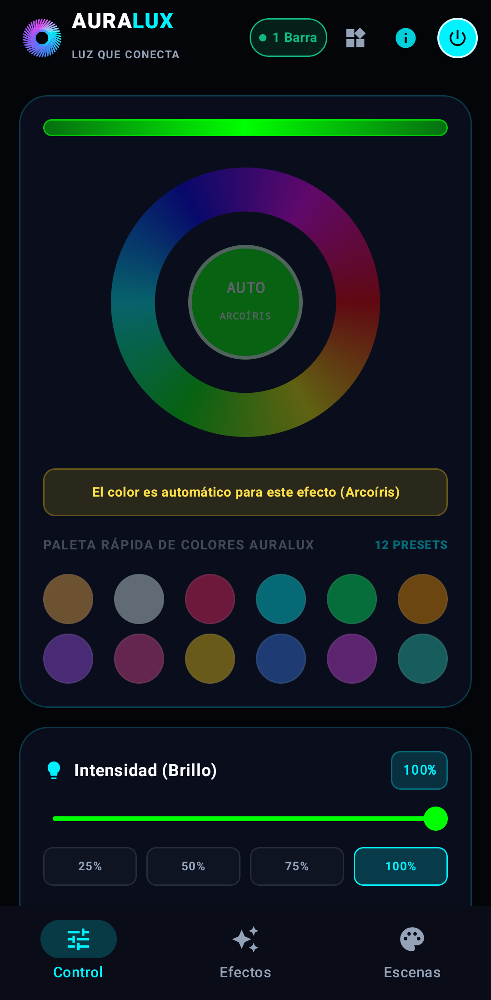
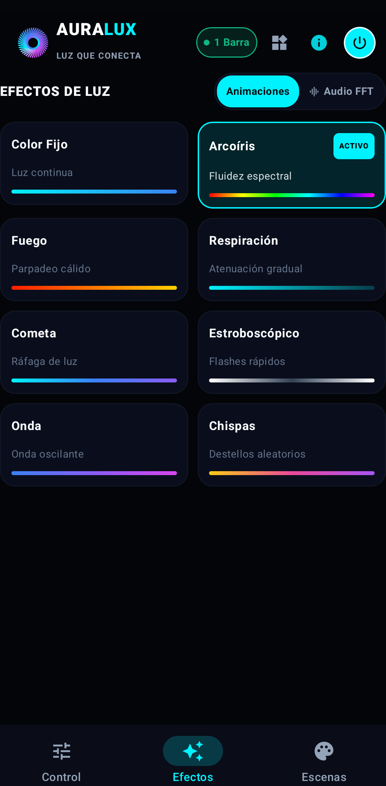
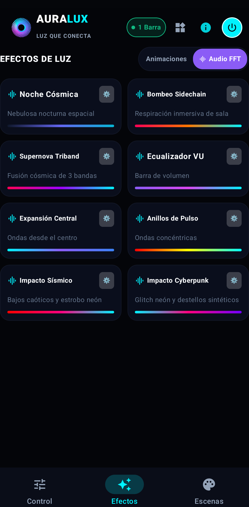

## 💡 What is AURALUX?                                                                                                                                                                                                                          
                                                                                                                                                                                                                                                    
  **AURALUX** is a high-performance **sound-reactive smart LED lightbar** engineered for gaming setups, music studios, and ambient workspaces.                                                                                                    
                                                                                                                                                                                                                                                  
  Unlike conventional commercial RGB lamps that rely on low-cost analog microphones and exhibit noticeable lag, AURALUX captures digital acoustic telemetry, performs real-time frequency analysis, and renders ultra-smooth visual dynamics at   
  **144 Hz with sub-20ms latency**, fully orchestrated via a dedicated **Android companion app**
# auralux-system-architecture
Deterministic Dual-Core ESP32-S3 firmware architecture, 144 Hz real-time rendering engine, 50 FPS UDP telemetry ingestion, and active power safety limiter.                                                                                                                                                                                                                                                                                                                                                                                                                               
  [](https://idf.espressif.com/)                                                                                                           
  [](https://www.espressif.com/en/products/socs/esp32-s3)                                                                  
  [](https://www.freertos.org/)                                                                                                                                    
  [](https://en.wikipedia.org/wiki/C_(programming_language))                                                                           
  [](https://opensource.org/licenses)                                                                                                    
                                                                                                                                                                                                                                                  
  > **Engineering Case Study:** This repository presents the system architecture, real-time deterministic scheduling, communication protocols, and electrical safety subsystems of **AURALUX**, a commercial-grade smart lighting and audio-      
telemetry platform developed for the **ESP32-S3**.                                                                                                                                                                                                
  > *Note: Proprietary visual effect algorithms and commercial application code are omitted to protect intellectual property.*                                                                                                                    
                                                                                                                                                                                                                                                  
  ---                                                                                                                                                                                                                                             
                                                                                                                                                                                                                                                  
  ## 📌 Executive Summary                                                                                                                                                                                                                         
                                                                                                                                                                                                                                                  
  Modern addressable LED controllers frequently suffer from frame stutter, high latency, and power hazards caused by mixing asynchronous network stacks (Wi-Fi/TCP) with microsecond-sensitive pixel rendering.                                   
                                                                                                                                                                                                                                                  
  **AURALUX** solves this via an **asymmetric multi-core architecture** on the ESP32-S3:                                                                                                                                                          
  - **Core 0 (Networking & Control):** Wi-Fi FSM, UDP real-time audio telemetry ingestion (50 FPS), HTTP REST JSON configuration, and dual-boot OTA management.                                                                                   
  - **Core 1 (Deterministic Rendering):** Hard real-time 144 Hz rendering loop (6.94 ms frame budget) with **zero dynamic memory allocations (`malloc`)** in the hot execution path.                                                              
  - **Sub-20ms System Latency:** Real-time synchronization from digital audio capture to photonic output.                                                                                                                                         
  - **Hardware-Level Power Limiter:** Active current estimation limiting strip consumption to 2000 mA to prevent brownouts and fire hazards.                                                                                                      
                                                                                                                                                                                                                                                  
  ---                                                                                                                                                                                                                                             
                                                                                                                                                                                                                                                  
  ## 🏗️ System Architecture                                                                                                                                                                                                                       
                                                                                                                                                                                                                                                  
  The ESP32-S3 dual Xtensa LX7 cores run under FreeRTOS with strict core affinity, preventing networking interrupts from degrading rendering determinism.                                                                                                                                                                                                                                                                                                                 
  ```mermaid                                                                                                                                                                                                                                      
  graph TB                                                                                                                                                                                                                                        
      subgraph Core0["Core 0: Asynchronous Networking & System Protocol"]
          WIFI["Wi-Fi Subsystem (Station / SoftAP)"]
          UDP["UDP Audio Receiver (Port 7777, 50 FPS)"]
          HTTP["HTTP REST JSON Engine (/api/led)"]
          ESPNOW["ESP-NOW Mesh Cluster Sync"]
          OTA["Dual-Boot OTA Manager (ota_0 / ota_1)"]
          NVS["Flash NVS Engine (1000ms Debounce Protection)"]
      end                                                                                                                                                                                                                                         

      subgraph IPC["Lockless IPC / Atomic State Exchange"]
        BUFFER["Double-Buffered State & Ring Buffers (Zero Allocations)"]                                                                                                                                                                       
      end
                                                                                                                                                                                                                                           
      subgraph Core1["Core 1: Deterministic Real-Time Rendering Engine"]
          TIMER["144 Hz Hardware Timer (6.94 ms Frame Budget)"]
          DSP["Real-Time DSP (Alpha-Beta Smoothing & Dynamic Falloff)"]
          PWR["Active Power Limiter (2000 mA Hard Safety Budget)"]
          RMT["RMT Peripheral Driver (WS2812B / WS2815 NRZ Timing)"]                                                                                                                                                                              
      end                                                                                                                                                                                                                                         
                                                                                                                                                                                                                                                  
      WIFI --> UDP                                                                                                                                                                                                                                
      WIFI --> HTTP                                                                                                                                                                                                                               
      WIFI --> ESPNOW                                                                                                                                                                                                                             
      UDP --> BUFFER                                                                                                                                                                                                                              
      HTTP --> BUFFER                                                                                                                                                                                                                             
      ESPNOW --> BUFFER                                                                                                                                                                                                                           
      BUFFER --> DSP                                                                                                                                                                                                                              
      TIMER --> DSP                                                                                                                                                                                                                               
      DSP --> PWR                                                                                                                                                                                                                                 
      PWR --> RMT                                                                                                                                                                                                                                 
  ```                                                                                                                                                                                                                                             
                                                                                                                                                                                                                                                  
  ---                                                                                                                                                                                                                                             
                                                                                                                                                                                                                                                  
  ## 📡 Telemetry & Communication Protocol                                                                                                                                                                                                        
                                                                                                                                                                                                                                                  
  ### 1. High-Speed UDP Audio Ingestion (Port 7777)                                                                                                                                                                                               
  For low-latency acoustic reaction, an external sensor node or mobile DSP client streams audio telemetry over UDP at **50 FPS**.       
 #### Real-Time Telemetry Pipeline (50 FPS Ingestion to 144 Hz Photons)                                                                                                                                                                                                                                               
  | Step | Flow / Stage | Operation | Execution Budget |                                                                                                                                                                                          
  | :---: | :--- | :--- | :---: |                                                                                                                                                                                                                 
  | **01** | `Audio Source` ➔ `Core 0` | Ingest 16-byte binary datagram over UDP (Port 7777) | 50 Hz (20 ms interval) |                                                                                                                           
  | **02** | `Core 0: UDP Task` | Validate magic byte (`0x41`), payload size & checksum | < 15 µs |                                                                                                                                               
  | **03** | `Core 0` ➔ `Core 1` | Zero-allocation atomic state exchange (pointer swap) | < 1 µs |                                                                                                                                                
  | **04** | `Core 1: Render Loop` | Alpha-Beta smoothing filter & dynamic VU falloff | 144 Hz (6.94 ms frame) |                                                                                                                                  
  | **05** | `Core 1: Safety Stage`| Active power limiter evaluation & current estimation | < 45 µs |                                                                                                                                             
  | **06** | `Core 1` ➔ `LED Strip`| Hardware RMT DMA transmission to physical diodes | Non-blocking |                                                                                                                                   
  #### Binary Frame Layout (16 Bytes Packed, `0x41`)                                                                                                                                                                                              
  | Offset | Field | Type | Description |                                                                                                                                                                                                         
  | :---: | :---: | :---: | :--- |                                                                                                                                                                                                                
  | `0x00` | `magic_byte` | `uint8_t` | Header identifier (`0x41` = 'A') |                                                                                                                                                                        
  | `0x01` | `vu_meter` | `uint8_t` | Peak audio amplitude ($0 - 255$) |                                                                                                                                                                          
  | `0x02` | `bass_energy` | `uint8_t` | Low-frequency band energy ($20 - 150 \text{ Hz}$) |                                                                                                                                                      
  | `0x03` | `mid_energy` | `uint8_t` | Mid-frequency band energy ($400 - 2500 \text{ Hz}$) |                                                                                                                                                     
  | `0x04` | `treble_energy`| `uint8_t` | High-frequency band energy ($4000 - 16000 \text{ Hz}$) |                                                                                                                                                
  | `0x05` | `bpm_estimate` | `uint8_t` | Detected tempo cadence ($60 - 200 \text{ BPM}$) |                                                                                                                                                       
  | `0x06` | `flags` | `uint8_t` | Beat trigger bit, sync markers |                                                                                                                                                                               
  | `0x07 - 0x0E` | `payload` | `uint8_t[8]` | Dynamic spatial energy vector |                                                                                                                                                                    
  | `0x0F` | `checksum` | `uint8_t` | XOR / Cyclic integrity verification |                                                                                                                                                                       
                                                                                                                                                                                                                                                  
  ### 2. HTTP REST JSON Control Plane                                                                                                                                                                                                             
  - Non-blocking HTTP server providing endpoints for mode configuration, color palettes, and global parameters.                                                                                                                                   
  - Protected NVS persistence using a **1000 ms debounce timer** to prevent Flash memory wear under rapid UI changes.                                                                                                                             
                                                                                                                                                                                                                                                  
  ---                                                                                                                                                                                                                                             
                                                                                                                                                                                                                                                  
  ## ⚡ Active Electrical Safety: Power Limiter                                                                                                                                                                                                   
                                                                                                                                                                                                                                                  
  Addressable LEDs (WS2812B/WS2815) consume up to ~60 mA per pixel at peak white ($R=255, G=255, B=255$). Driving dozens of LEDs without current governance leads to voltage drops, thermal throttling, and power supply overload.                
                                                                                                                                                                                                                                                  
  AURALUX implements an **active hardware-safety algorithm** evaluated every frame:                                                                                                                                                               
                                                                                                                                                                                                                                                  
                                                                                                                                                                                                                                                  
  #### Dynamic Power Regulation Algorithm
  
  ```text
    Input:  RGB Frame Buffer [N_LEDS]
    Budget: I_BUDGET = 2000 mA (Hard Limit)
    
    1. Compute Projected Current:
       I_frame = I_quiescent + SUM(0.21 * R[i] + 0.15 * G[i] + 0.15 * B[i])
    
    2. Safety Evaluation:
       IF (I_frame <= I_BUDGET):
           scale_factor = 1.0  (Safe: No attenuation needed)
       ELSE:
           scale_factor = (I_BUDGET - I_quiescent) / (I_frame - I_quiescent)
    
    3. Subpixel Scaling (Preserves Hue & Saturation):
       FOR EACH pixel i IN Frame:
           R[i] = R[i] * scale_factor
           G[i] = G[i] * scale_factor
           B[i] = B[i] * scale_factor
    
    Output: Safe RGB Buffer -> Dispatched to RMT DMA Hardware Driver
    
   ``` 
  ---                                                                                                                                                                                                                       
                                                                                                                                                                                                                                                  
                                                                                                                                                                                                                                                  
  - **Static Quiescent Current:** Accounts for internal controller logic (~1 mA per pixel idle).                                                                                                                                                  
  - **Subpixel Weighting:** Accurately models non-linear power consumption across Red, Green, and Blue diodes.                                                                                                                                    
  - **Seamless Attenuation:** Prevents power supply collapse while maintaining color hue accuracy.                                                                                                                                                
                                                                                                                                                                                                                                                    
  ---
                                                                                                                                                                                                                                          
                                                                                                                                                                                                                                                  
  ## 🛡️ Reliability & OTA Dual-Boot Architecture                                                                                                                                                                                                  
                                                                                                                                                                                                                                                  
  To support continuous remote upgrades in commercial deployments, the storage layout is partitioned with anti-rollback safety:                                                                                                                   
                                                                                                                                                                                                                                                  
  ```text                                                                                                                                                                                                                                         
  +--------------------------------------------------------------+                                                                                                                                                                                
  |                    ESP32-S3 Flash Memory                     |                                                                                                                                                                                
  +------------+------------+------------+-----------+-----------+                                                                                                                                                                                
  | NVS Storage| Bootloader | Partition  |   ota_0   |   ota_1   |                                                                                                                                                                                
  | (Params)   |            | Table      | (Active)  | (Passive) |                                                                                                                                                                                
  +------------+------------+------------+-----------+-----------+                                                                                                                                                                                
  ```                                                                                                                                                                                                                                             
                                                                                                                                                                                                                                                  
  1. **Dual Boot Partitions (`ota_0` / `ota_1`):** Image download occurs in background via HTTP/HTTPS on Core 0.                                                                                                                                  
  2. **Self-Validation on First Boot:** The newly flashed firmware must successfully boot, initialize peripherals, and validate system health.                                                                                                    
  3. **Rollback Safeguard:** If health check fails or a watchdog reset occurs before confirmation, the bootloader automatically reverts to the previous stable partition.                                                                         
                                                                                                                                                                                                                                                  
  ---                                                                                                                                                                                                                                             
                                                                                                                                                                                                                                                  
  ## 📊 Performance Benchmarks                                                                                                                                                                                                                    
                                                                                                                                                                                                                                                  
  | Metric | Target Specification | Measured on ESP32-S3 (240 MHz) |                                                                                                                                                                              
  | :--- | :---: | :---: |                                                                                                                                                                                                                        
  | **Render Refresh Rate** | 144 Hz (6.94 ms / frame) | **144.1 Hz (deterministic)** |                                                                                                                                                           
  | **Render Execution Time** | < 4.0 ms | **1.8 ms - 2.6 ms** |                                                                                                                                                                                  
  | **UDP Telemetry Ingestion** | 50 Hz (20 ms period) | **50 Hz sustained** |                                                                                                                                                                    
  | **End-to-End Latency (Audio -> LED)** | < 30 ms | **12 ms - 18 ms** |                                                                                                                                                                         
  | **Heap Allocations in Hot Path** | 0 bytes / frame | **0 bytes (Strict Zero-Alloc)** |                                                                                                                                                        
  | **Electrical Safety Cap** | 2000 mA | **Enforced (±2.5% accuracy)** |                                                                                                                                                                         
                                                                                                                                                                                                                                                  
  ---                                                                                                                                                                                                                                             
                                                                                                                                                                                                                                                  
  ## 🔌 Hardware Stack & Peripherals                                                                                                                                                                                                              
                                                                                                                                                                                                                                                  
  - **MCU:** ESP32-S3 Dual-Core Xtensa LX7 @ 240 MHz (512 KB SRAM, 8 MB Flash)                                                                                                                                                                    
  - **LED Physical Layer:** RMT (Remote Control Peripheral) generating strict non-return-to-zero (NRZ) timing pulses (0.4 µs / 0.8 µs) without CPU bit-banging.                                                                                   
  - **Audio Acquisition Node:** I2S MEMS Digital Microphone (INMP441) with hardware DMA sampling at 16 kHz / 24-bit.                                                                                                                              
  - **Power Subsystem:** 5V regulated rail with decoupling capacitors ($1000\mu\text{F}$ bulk + $0.1\mu\text{F}$ ceramic), high-speed level shifters (3.3V to 5.0V logic).                                                                        
                                                                                                                                                                                                                                                  
  ---   

  ## Companion Android App (Jetpack Compose)   

https://github.com/user-attachments/assets/998c1e82-117e-412c-be9d-28bf99e592cb

                                                                                                                                                                                                
                                                                                                                                                                                                                                                    
  The system includes a native Android client developed in **Kotlin** with **Jetpack Compose** and **Clean Architecture**:                                                                                                                        
  - **Real-Time DSP Engine:** Extracts spectral band metrics and streams 16-byte UDP binary datagrams at 50 FPS.                                                                                                                                  
  - **Device Management:** mDNS discovery, HTTP REST delta synchronization, and real-time color wheel control.                                                                                                                                    
                                                                                                                                                                                                                                                  
  <div align="center">                                                                                                                                                                                                                            
                                                                                                                                  
                                                                                                                            
                                                                                                                               
  </div> 
                                                                                                                                                                                                                                                  
  ## 👨‍💻 Engineer & Contact                                                                                                                                                                                                                        
                                                                                                                                                                                                                                                  
  **Daniel Santiago Arcila Gómez**                                                                                                                                                                                                                
  Electronics Engineer — Universidad de Antioquia (Medellín, Colombia)                                                                                                                                                                            
  Specialized in Embedded Systems, Real-Time Firmware & Telemetry Architectures.                                                                                                                                                                  
                                                                                                                                                                                                                                                  
  - 💼 **LinkedIn:** [daniel-santiago-arcila-gómez](https://www.linkedin.com/in/daniel-santiago-arcila-g%C3%B3mez-2b8634206/)                                                                                                                     
  - 📧 **Email:** `ds.arcilag@gmail.com`                                                                                                                                                                                                          
  - 🌐 **GitHub:** https://github.com/danielarcil4
